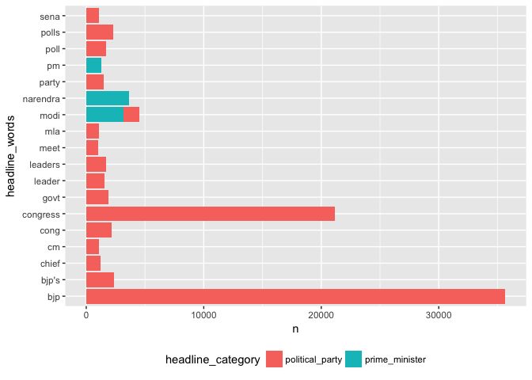
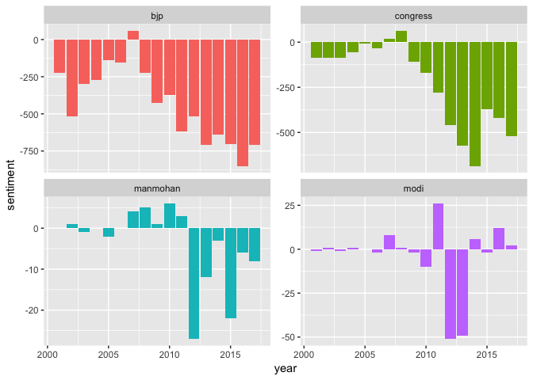
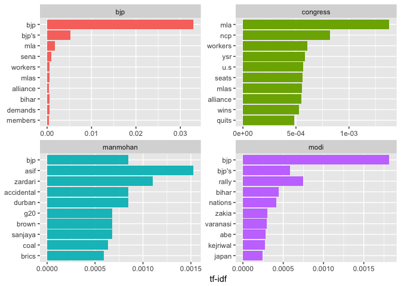
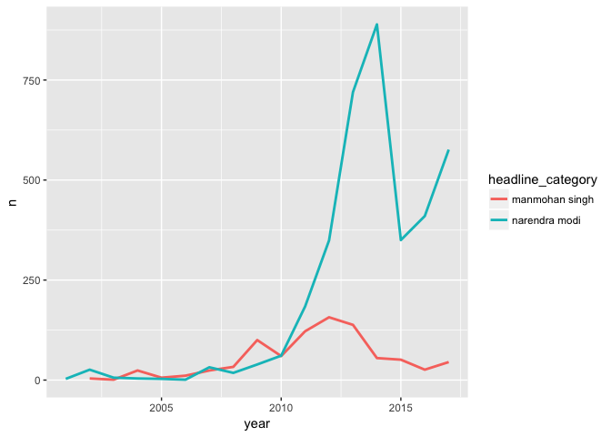
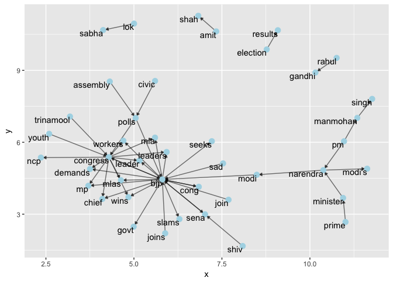

TOI Political Coverage - A Tidy Analysis
================
Suhas Hegde
March 6, 2018

This small analysis focuses on the political coverage given in Times of India regarding two major political parties, BJP and the Congress. The analysis is structured in the tidy format prescribed by Dr. Julia Silge and Dr. David Robinson.

The data was gathered from a kaggle dataset and it is available at 
[https://www.kaggle.com/therohk/india-headlines-news-dataset](https://www.kaggle.com/therohk/india-headlines-news-dataset)

### Data Tidying -

``` r
# required libraries
library(tidytext)
library(tidyverse)
library(lubridate)
library(igraph)
library(ggraph)

# read the data
#news <- read_csv("../input/india-news-headlines.csv")
news <- read_csv("india-news-headlines.csv")

# convert all the text into lowercase 
news %>% pull(headline_category) %>% str_to_lower(.) ->news$headline_category
news %>% pull(headline_text) %>% str_to_lower(.) -> news$headline_text


# convert the date column into "date" data-type
news %>% pull(publish_date) %>% ymd(.) -> news$publish_date


# filter out headlines related to modi, manmohan singh, bjp and congress
news %>% filter(str_detect(news$headline_text,"(narendra modi)|(bjp)|(congress)|(manmohan singh)")) -> politics_ind_tidy


# find out total number of categories in the dataset
politics_ind_tidy %>% pull(headline_category)%>% 
  unique(.) %>%
  as.data.frame(.) %>% count()
```

    ## # A tibble: 1 x 1
    ##       n
    ##   <int>
    ## 1   268

The original data seems to have too many categories, so creating 2 main categories is much more useful for the analysis down the road.

``` r
# build an alternative str_detect function
str_detect_politics <- function(string){
  politics_ind_tidy %>% pull(headline_text) %>%
    str_detect(., string)
}

# convert the categories into 3 main categories, congress, bjp and prime_minister and other sub-categories 
politics_ind_tidy %>%
   mutate(headline_category = case_when(
     str_detect_politics("(narendra modi)|(manmohan singh)") ~ "prime_minister",
     str_detect_politics("(bjp)") ~ "political_party",
     str_detect_politics("(congress)") ~ "political_party"
   ), headline_sub_category = case_when(
     str_detect_politics("(manmohan singh)") ~ "manmohan",
     str_detect_politics("(narendra modi)") ~ "modi",
     str_detect_politics("(bjp)") ~ "bjp",
     str_detect_politics("(congress)") ~ "congress"
   ) ) -> politics_ind_tidy

# convert the data to tidy format
politics_ind_tidy %>% group_by(headline_category) %>%
  unnest_tokens(., headline_words, headline_text) -> politics_ind_tidy

politics_ind_tidy
```

    ## # A tibble: 509,299 x 4
    ## # Groups:   headline_category [2]
    ##    publish_date headline_category headline_sub_category headline_words
    ##    <date>       <chr>             <chr>                 <chr>         
    ##  1 2001-01-02   political_party   bjp                   bjp           
    ##  2 2001-01-02   political_party   bjp                   jumps         
    ##  3 2001-01-02   political_party   bjp                   into          
    ##  4 2001-01-02   political_party   bjp                   rail          
    ##  5 2001-01-02   political_party   bjp                   track         
    ##  6 2001-01-02   political_party   bjp                   conversion    
    ##  7 2001-01-02   political_party   bjp                   issue         
    ##  8 2001-01-02   political_party   bjp                   bjp           
    ##  9 2001-01-02   political_party   bjp                   jumps         
    ## 10 2001-01-02   political_party   bjp                   into          
    ## # ... with 509,289 more rows

### Analysis -

The first thing to look at is word counts for monograms that are not stop words in the English language. So words such as, the, for etc. are removed since they would be the most occurring words in any given corpus.

``` r
# calculate word frequencies for words that are not stop words
politics_ind_tidy %>%
  group_by(headline_category) %>%
  anti_join(stop_words, by = c("headline_words" = "word")) %>%
  count(headline_words, sort = TRUE) %>%
  filter(n > 1000) %>%
  ggplot(., aes(headline_words, n)) +
  geom_col(aes(fill = headline_category)) +
  coord_flip() +
  theme(legend.position = "bottom")
```



As expected the words "bjp" and "congress" have the highest number of counts since the data-set has been filtered accordingly. One interesting note is that "manmohan singh" seems to be a word that feature in here. Let us look at how many times a monogram that contains "manmohan" "singh" features in the corpus.

``` r
politics_ind_tidy %>%
  group_by(headline_category) %>%
  anti_join(stop_words, by = c("headline_words" = "word")) %>%
  count(headline_words, sort = TRUE) %>%
  filter(headline_words == "manmohan" | headline_words == "singh") 
```

    ## # A tibble: 4 x 3
    ## # Groups:   headline_category [2]
    ##   headline_category headline_words     n
    ##   <chr>             <chr>          <int>
    ## 1 prime_minister    manmohan         869
    ## 2 prime_minister    singh            857
    ## 3 political_party   singh            778
    ## 4 political_party   manmohan          48

It seems like all the monograms that belong to the former prime minister don't feature often enough in the headlines.

Let us do a sentiment analysis on the given words and see how the headlines have fared over the years.

``` r
# sentiment analysis
politics_ind_tidy %>%
  inner_join(get_sentiments("bing"), by = c("headline_words" = "word")) %>%
  count(headline_sub_category, index = year(publish_date) ,sentiment) %>%
  spread(sentiment, n, fill = 0) %>%
  mutate(sentiment = positive - negative) -> politics_sentiment


politics_sentiment %>%
  ggplot(., aes(index, sentiment, fill = headline_sub_category)) +
  geom_col(show.legend = FALSE) +
  facet_wrap(~headline_sub_category, nrow = 3, scales = "free_y") +
  xlab("year")
```



It seems like if you are a major political party in India TOI headlines are going to be negative most of the time! Both, BJP and the Congress have a net negative sentiment scores over the years except for two occasions. Manmohan Singh of UPA-1 (2004-2008) seems to get more positive coverage than the Manmohan of UPA-2 government. Narendra Modi on the other hand (after 2010), gets alternative coverage where the net sentiment oscillates between positive to extremely negative scores. We have to always be careful about sentiment analysis run on monograms since they can lead to false scores. A sentence such as, "this is not good" will get a neutral score even though it is saying otherwise since the sentiment analysis run on monograms doesn't account for context. There is also case of using the right lexicon. Here since the corpus is big enough we have assumed that the error rate is manageable and doesn't lead to false conclusions. The other thing we could do is to look at tf-idf score and promote words that are considered to be more valuable in a given corpus.

``` r
# calculate tf*idf scores and find out unique valuable words
# calculate the count for each group and each word
politics_ind_tidy %>%
  ungroup() %>%
  count(headline_sub_category, headline_words, sort = TRUE) %>%
  ungroup()-> head_words


  head_words %>%
  group_by(headline_sub_category) %>%
  summarise(total = sum(n)) -> total_words
  
  head_words <- left_join(head_words, total_words)
  
  head_words %>% bind_tf_idf(headline_words, headline_sub_category, n) -> head_words
  
  head_words %>% 
    arrange(desc(tf_idf)) %>%
    mutate(headline_words = factor(headline_words, levels = rev(unique(headline_words)))) %>%
    group_by(headline_sub_category) %>%
    #filter(tf_idf >=.1) %>%
    top_n(10) %>%
    ungroup() %>%
    ggplot(aes(headline_words, tf_idf, fill = headline_sub_category)) +
    geom_col(show.legend = FALSE) +
    labs(x = NULL, y = "tf-idf") +
    facet_wrap(~headline_sub_category, ncol = 2, scales = "free") +
    coord_flip()
```

 Looking at the tf-idf score some words do stand out. The word "coal"(manmohan sub-category) refers to the coal scam, whereas under modi it seems like the "bihar elections" and "kejriwal"" seem to stand out.

Let us look at the amount of coverage both Mr. Singh and Mr. Modi have received over the years as a time series plot.

``` r
# see the total of counts over time mentioning modi and manmohan
news %>%
  filter(str_detect(news$headline_text,"(narendra modi)|(manmohan singh)")) %>%
  mutate(headline_category = str_extract(.$headline_text, "(narendra modi)|(manmohan singh)")) -> modi_manmohan
  
modi_manmohan %>%
  group_by(year =year(publish_date)) %>%
  count(year, headline_category) %>%
  ggplot(., aes(year , n, group = headline_category, color = headline_category)) +
  geom_line(size =1)
```



It seems like Narendra Modi is getting almost 3 times the coverage Manmohan Singh received as a prime minister. Also, the other thing to note here is Manmohan Singh's coverage as prime minister during the UPA-1 era seems to very modest and on par with that of Chief Minister Modi!

One final thing we could do is draw a network-graph and look at the relationship between various players involved in the political scene in India.



It looks BJP and the Congress are at the center of nodes indicating that they are the most used terms in the headlines over the years. One interesting observation here is that "rahul gandhi" and "amith shah" seems to be mentioned often enough but not preceded or followed by their respective parties. It could also be because we have only filtered out headlines related to the two major parties and their leaders. It would be interesting to see what this graph would like if we included all the data that is somehow related to politics in India.

The analysis above looks at a small subset of data and hence may not represent a complete picture, but it should surely give a perspective on what the headlines say about major political parties and their leaders in India. The next post I might try to slice and dice the data in a much more deeper manner and try to do Topic Modelling so that we can look at how various clusters are formed in the given corpus.
